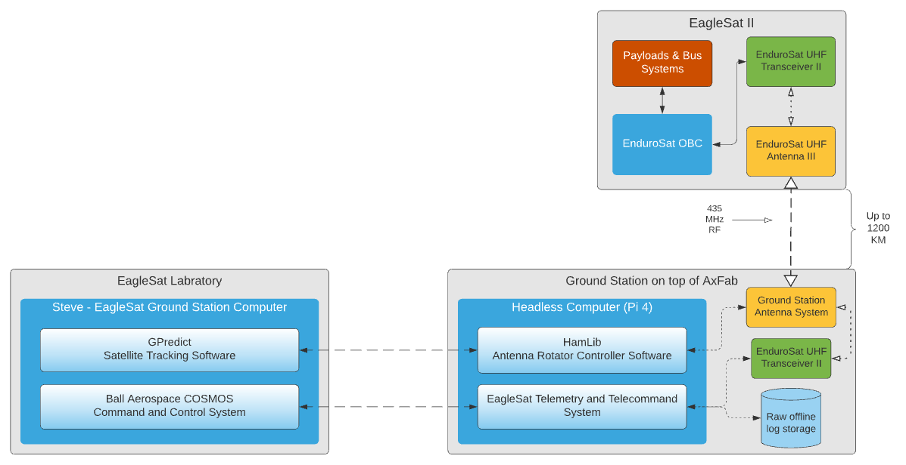

# EagleSat Telemetry and Telecommand System   
EagleSat is a student-led organization at Embry-Riddle Aeronautical University. The EagleSat Telemetry and Telecommand System 
(ESTTS) is a software package that facilitates communication between a ground
Command and Control system (C2) like [Ball Aerospace COSMOS](https://github.com/BallAerospace/COSMOS) and satellite in orbit.
EagleSat as an organization wrote this software to communicate with EagleSat-2, a 3U CubeSat performing research on the
effects of cosmic radiation.

* [Getting Started](docs/getting-started.md)
* Usage
    * [Documentation](docs/index.md)
* [License](LICENSE)

## Overview

ESTTS was designed as modular platform to queue and schedule commands to their respective endpoints. The endpoints associated with
our mission are the ground station (ESTTS), the transceiver existing on the satellite, and on-board computer (OBC) that controls
all operations on the satellite. Challenges that led to the development of ESTTS are below:
1. How can we guarantee that commands sent from the C2 platform (COSMOS) terminate at EagleSat-2 and not free space?
2. How can we manage commands that are sent to multiple endpoints at the same time, when all endpoints are dependant on each other
   1. The base of the EagleSat-2 communications infrastructure is an [EnduroSat UHF Transceiver II](https://www.endurosat.com/cubesat-store/cubesat-communication-modules/uhf-transceiver-ii/) module
   2. The transceiver is used to collect to general metrics related to communication, as well as communicate with the satellite. The challenge with this is that you can only do one of these operations at a time. ESTTS regulates this problem
3. Space was a constraint for the physical ground station, and we had to install the antenna in a remote location on top of a building. How can we still effectively manage the ground station and its operation from our laboratory?

We answered these questions by building the ESTTS groundstation_manager API. The ground station manager allows a user
to programmatically configure endpoints associated with their satellite communication infrastructure. Once configured,
users can schedule commands to execute, IE sent to their respective endpoints, and handle the response to that command accordingly.

## How does ESTTS fit into EagleSat's communications infrastructure?
ESTTS is designed to run on a Raspberry Pi or similar in a remote location. This repository configures ESTTS to work with
The EnduroSat Transceiver II via UART over USB, and Ball Aerospace COSMOS using plugins configured as TCP/IP Server interfaces.
Each plugin in COSMOS communicates with a different endpoint in ESTTS. The ground station manager inside ESTTS
checks the satellite range at a pre-defined rate, and ensures that commands destined for the _satellite_ are only executed
when the satellite is in range.

## What problems does ESTTS _NOT_ address?
ESTTS does not care how the antenna on a ground station is pointed. It doesn't even know how data is actually sent to the satellite,
all it knows is how to forward data from a C2 platform to an endpoint that is typically configured as a serial interface.
This means that a ground station architecture must have other ideas for how to rotate the antenna. The following diagram
shows how we accomplished this for EagleSat-2.

## Software Requirements
* CMake
  * [CMake](https://cmake.org/download/) (v3.4 +)
* C++ Compiler
  * [Clang](https://clang.llvm.org/get_started.html) or [GCC](https://gcc.gnu.org/install/)

## Hardware Requirements
* Transceiver
  * [EnduroSat UHF Transceiver II](https://www.endurosat.com/cubesat-store/cubesat-communication-modules/uhf-transceiver-ii/)
